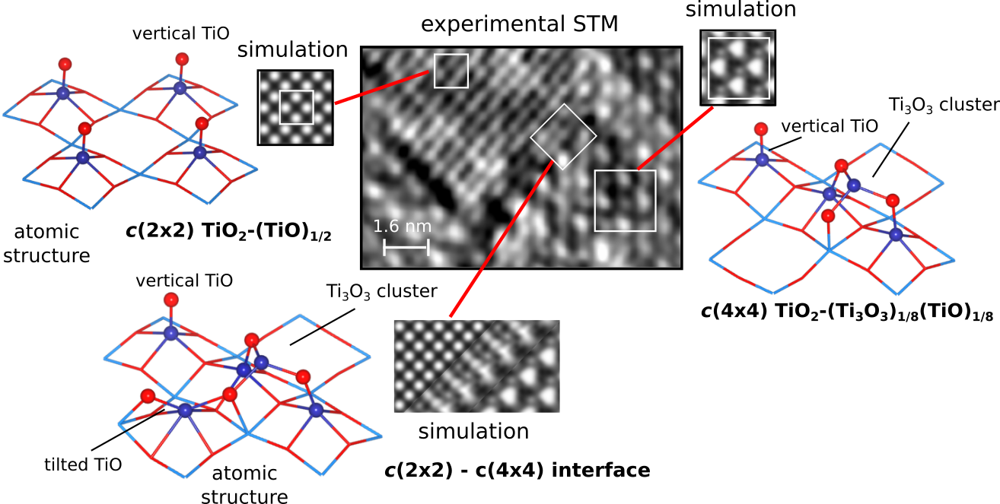

### Current Research

#### (Photo)electrochemical Water Splitting

#### Oxygen Evolution Reaction (OER)

#### Catalysis on Surface-Functionalized Plasmonic Metals

Nanoplasmonics is recognized to be one of the potentially transformative methods for photo-driven heterogeneous catalysis. Localized surface plasmon resonances (LSPRs) can greatly influence chemical processes occurring on a metal catalysts’ surface via energetic charge-carrier generation, local field enhancement, local heating, or combinations thereof. 

Recently, we show that the N2 dissociation barrier can be effectively reduced via accessing electronically excited-states, which we predicted via the embedded n-electron valence second order perturbation theory. 

Published in: J. M. P. Martirez, and E. A. Carter, Excited-State N2 Dissociation Pathway on Fe-Functionalized Au. J.  Am. Chem. Soc., 139, 4390-4398 (2017)

#### Understanding equilibrium and non-equilibrium phases of oxide surfaces

#### Coexistence of reconstructed surface phases : thermodynamics vs. kinetics

Metal oxide surfaces are known to undergo a plethora of phase transformations while maintaining the same structure in the bulk. This is especially true for transition metals oxides in which mixed metal oxidation states are prevalent. BaTiO3 undergoes several surface reconstructions associated with the changes in the oxidation state of Ti in the surface. We found, through a combination of experimental surface imaging (via scanning tunneling microscopy, STM), and atomic-scale ab intio modeling, STM simulations, and thermodynamics, that the surface of BaTiO3 when subject to reducing conditions undergoes TiO enrichment. Additionally thermodynamic and kinetic phases may arise due to the energetics of surface diffusion of the TiO defect units.     

Published in E. H. Morales, J. M. P. Martirez, W. A. Saidi, A. M. Rappe, and D. A. Bonnell, Coexisting Surface Phases and Coherent One-Dimensional Interfaces on BaTiO3(001). ACS Nano 8, 4465-4473 (2014)
