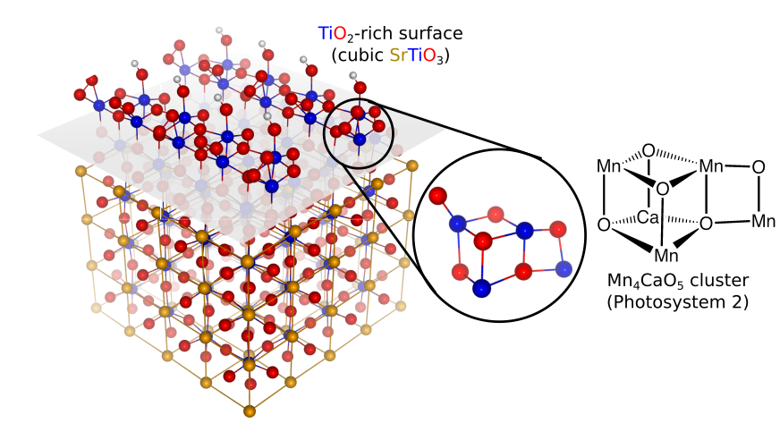

## Research

### (Photo)electrochemical Water Splitting

#### Hydrogen Evolution Reaction (HER)

Compositionally rich surface phases of HER-active NixPy compounds 

Ni2P and Ni5P4 are among the most promising alternatives to Pt as cathodes for water splitting. The origin of their activities is likely derived from P atoms that dominate their surfaces. We predict P-rich stable surface reconstructions, which provide clues into what makes Ni5P4 better than Ni2P in HER activity.

Published in: R. B. Wexler, J. M. P. Martirez, and A. M. Rappe, Stable Phosphorus Enriched (0001) Surfaces of Nickel Phosphides. Chem. Mater. 28, 5365-5372 (2016)

#### Oxygen Evolution Reaction (OER)

OER on Reconstructed SrTiO3 surface: Taking Clues from Nature

SrTiO3 has been known for years to be a water splitting catalysts that can generate both H2 and O2 from upon illumination with sunlight, without the need for any external potential bias. We predict, and experimentally verified, that the high-temperature surface phase: TiO2-rich (a.k.a. TiO2 double layer) reconstruction of SrTiO3(001), is able to catalyze water oxidation more efficiently than the native surfaces. The structural unit exhibit striking resemblance to the cubane-like metal oxide cluster found in the oxygen evolving centers of photosytem II protein complexes. This finding show that catalytic activity can be tuned with structural modifications, and illustrates that indeed structure can affect function.   

Published in: J. M. P. Martirez, S. Kim, E. H. Morales, B. T. Diroll, M. Cargnello, T. R. Gordon, C. B. Murray, D. A. Bonnell, and A. M. Rappe, Synergistic Oxygen Evolving Activity of a TiO2-rich Reconstructed SrTiO3(001) Surface.  J. Am. Chem. Soc. 137, 2939-2947 (2015)
